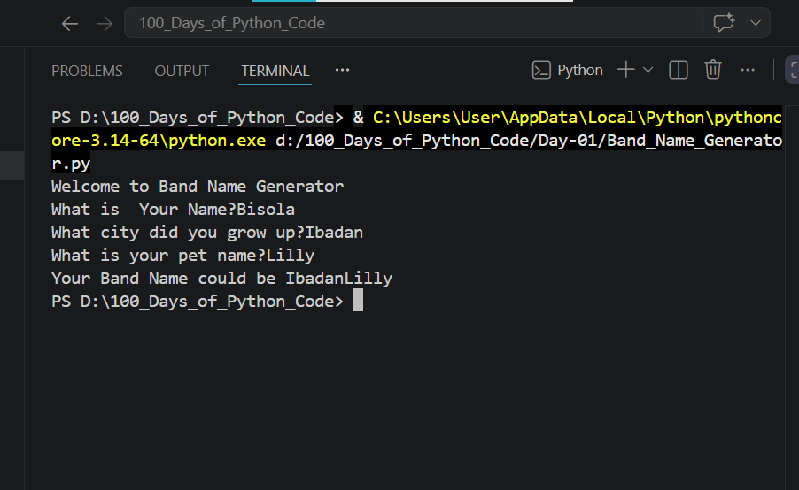

## Day-01:PRINTING TO THE CONSOLE IN PYTHON
## Objective
To understand Print to console in Python
## What I Learned
1. Print Function: Is use to display output 
2. String Manipulation and code intelligence:concatenating string using(+) and \n is use to break into new line
3. Input Function:Allows users to enter data
4. Python Variable:Is a container that store data values.
5. Len()Fuction:Is use to find the number of items (the "length") in an object

## What I Built
I built a Band Name Generator which helps you generate a Band Name
## Challenges Faced
None
## Output

