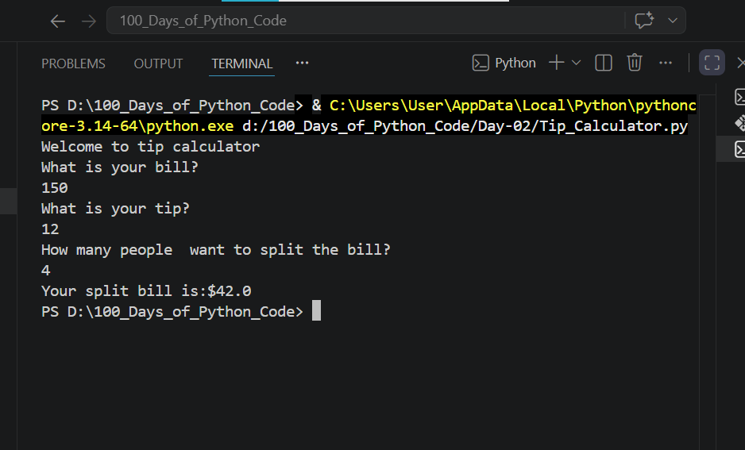

## Day-02:TIP CALCULATOR
## Objective
My objective is to understand Data Types and how to manipulate strings
## What I Learned
1. Data Type and Conversion:I learnt about Strings,Integers,Floats,Boolean data types and how to convert them
2. Mathematical Operation:It helps  to perform math using simple symbols called arithmetic operators.
3. Formatted string:which means injecting variables or expressions into a piece using f-string

## What I Built
Tip Calculator which helps friend to split bills 

## Challenges Faced
None
## Output

