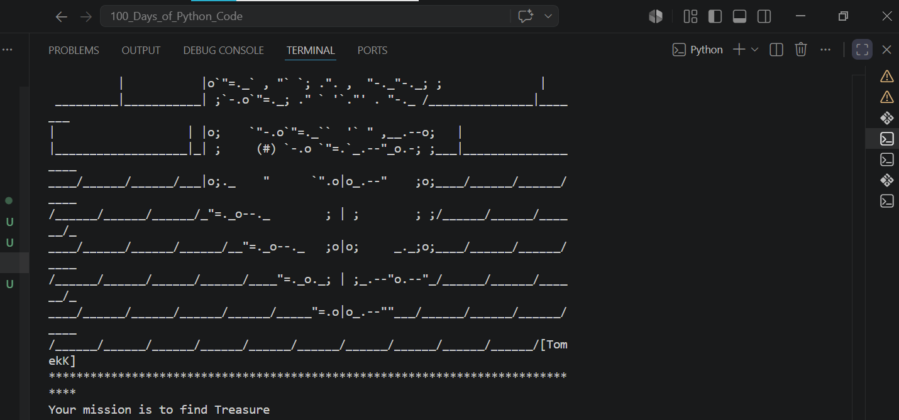
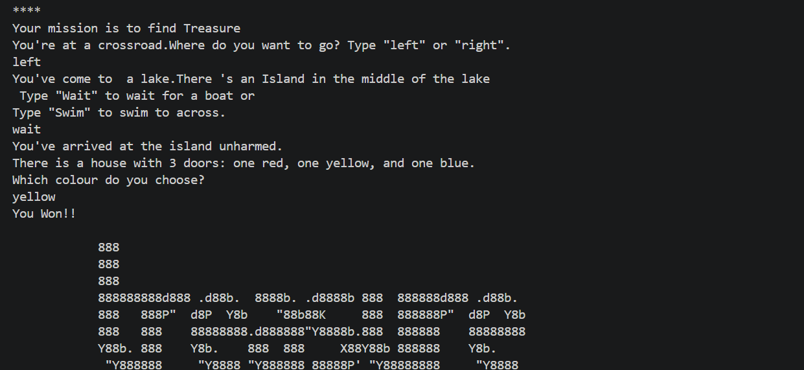
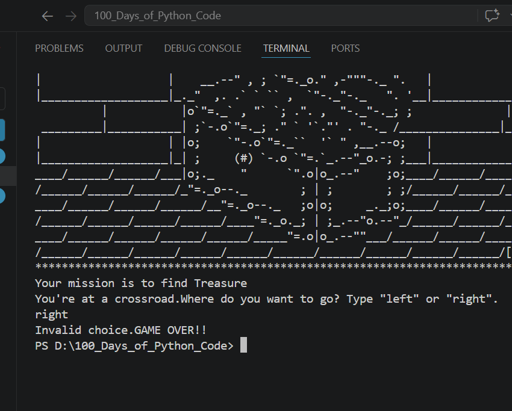

# Day-03:TREASURE ISLAND ADVENTURE GAME
## Project Objective
The Treasure Island Adventure game is an interactive text-based game in which players make decisions to explore an island and ultimately discover hidden treasure.
## What I Learned
I learned how to use conditional statements to control game flow based on user choices. I also improved my understanding of handling user input, building logic step by step, and creating an interactive experience using Python.

## How Treassure Island Advanture Game Works
The game asks the player to make a series of choices at different stages of the story. Each decision leads to a different outcome, guiding the player either closer to the treasure or ending the game. The flow of the game is controlled using conditional statements based on the player’s input.

## Output

