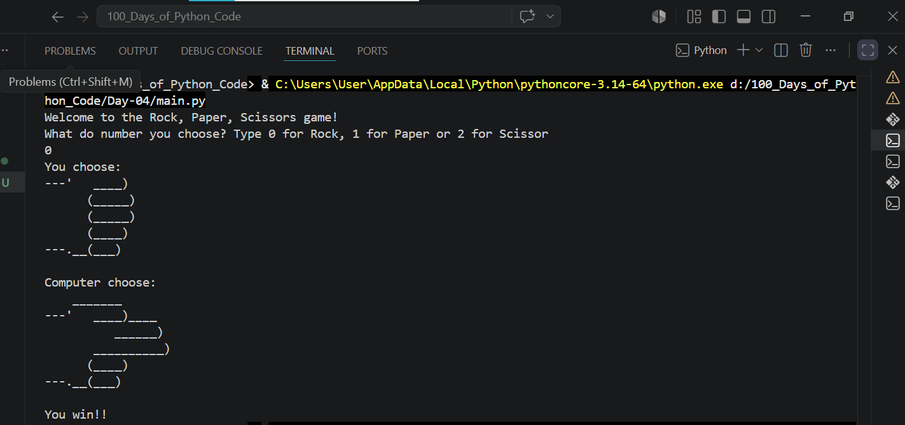
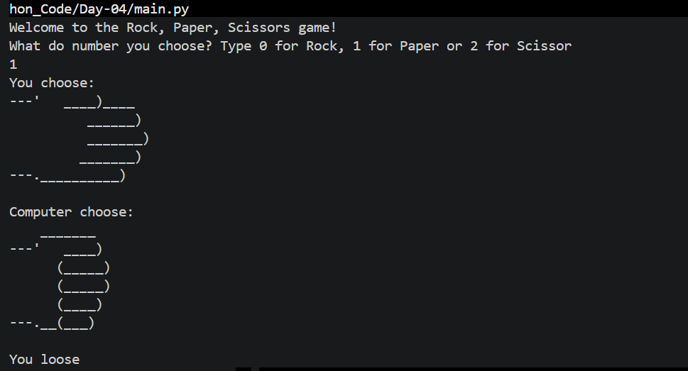

# Day-04:ROCK PAPER SCISSOR GAME
## Project Objective
The Rock Paper Scissors Game enables the user to compete against the computer, where the computer makes its choice randomly.

## What I Learned
I learned how to use random selection to simulate computer choices and how to apply conditional statements to compare results. I also improved my understanding of game logic, user input handling, and decision-making in Python.

## How Rock,Paper,Scissor Game Works
The user selects either rock, paper, or scissors, while the computer randomly chooses one option. The program then compares both choices using rules to determine the winner, loser, or a draw, and displays the result.

## Output

