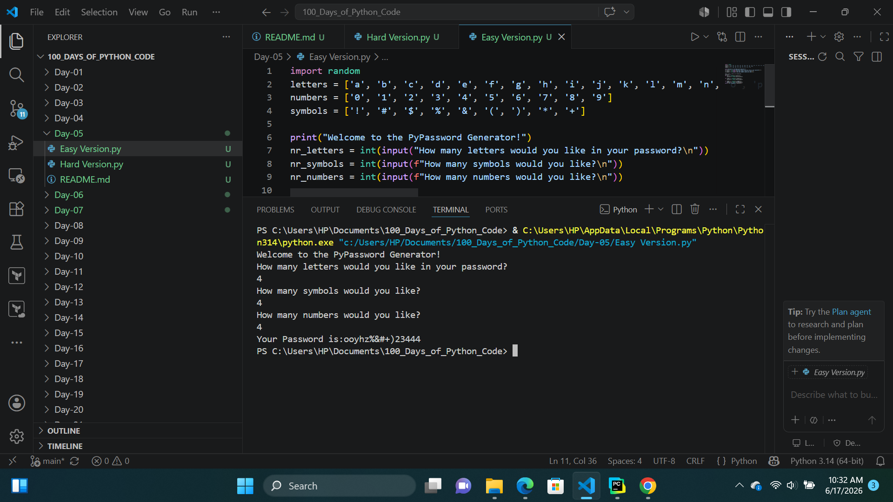
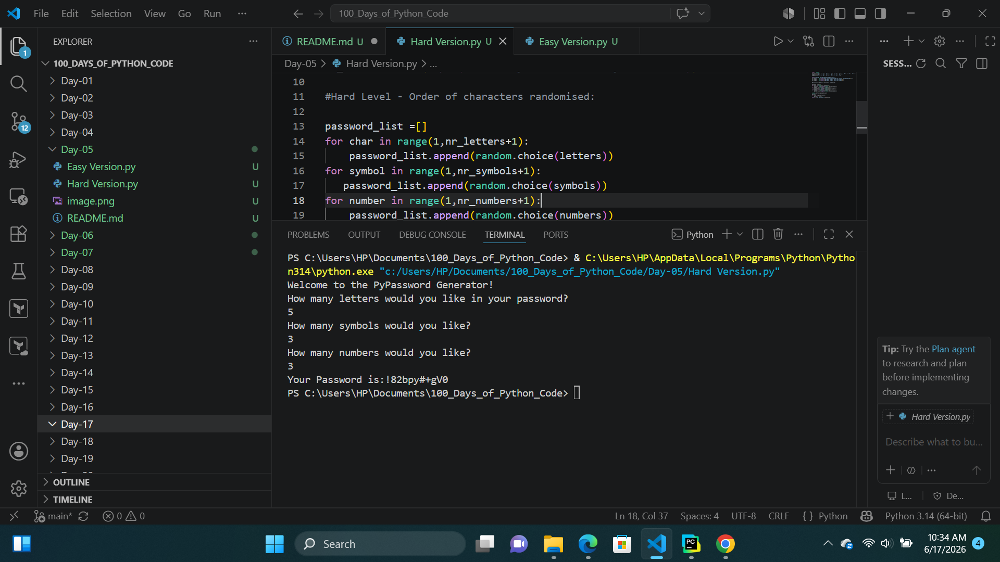

# Day-05:PASSWORD GENERATOR
## Project Objective 
Built a Password Generator that generates two versions of passwords:
1. Easy Version: Creates a password with letters, numbers, and symbols arranged in a fixed sequence.
2. Hard Version: Generates a more secure password by randomly shuffling letters, numbers, and symbols for increased complexity and unpredictability.
## What I Learned

1. Gained a solid understanding of how to use for loops to iterate through sequences and perform repetitive tasks efficiently.

2. Learned how to work with Python's built-in functions such as sum(), max(), and min() to perform quick calculations.

3. Explored how the range() function can be combined with for loops to control iterations and execute code a specific number of times.

## How Password Generator  Works

The user specifies the number of letters, symbols, and numbers to include in the password,then the Password generator generates:

1. Easy Version: Generates the password in a fixed sequence, with letters first, followed by symbols, and then numbers.

2. Hard Version: Generates the password by randomly shuffling all selected letters, symbols, and numbers, ensuring that the final password does not follow a predictable pattern and is more secure.

## Output
## Easy Version

## Hard Version

