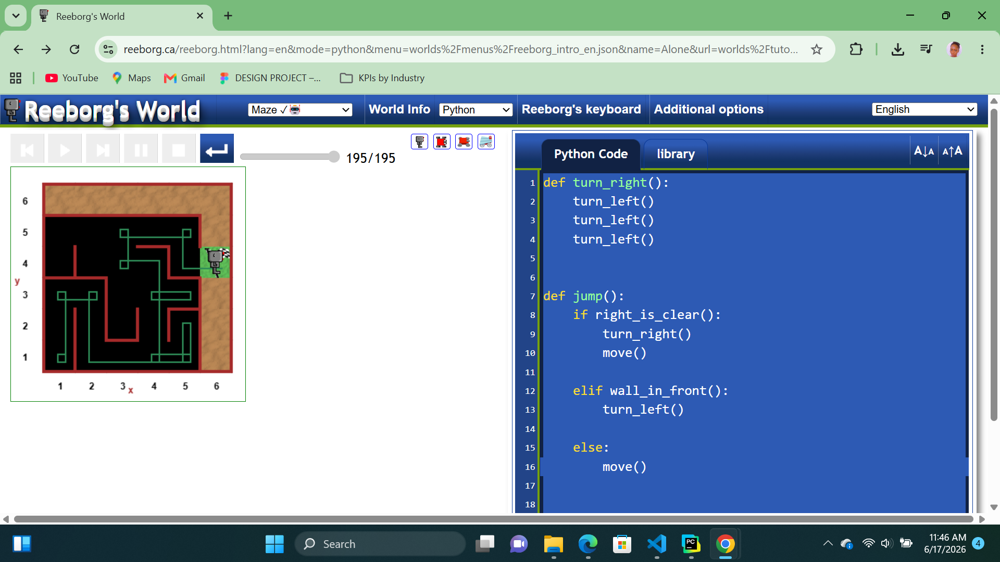

# Day-06: Reborg's World Maze Challenge
## Project Objective 
The Reborg’s World Maze Challenge features a robot named Reborg that starts at a random position in the maze and is initially facing a random direction. The objective is to use logical commands to navigate Reborg to the finish point.
## What I Learned
I learned how to define and call functions, as well as how to work with while loops.
## How Password Generator  Works
1. Open your browser and search for Reeborg’s World, then select the “Maze” world.
2. Created a function turn_right() by combining three turn_left() commands to make the robot turn right.
3. Defined a jump() function to control the robot’s movement logic.
  - Inside the jump() function, checked conditions:
  - If the right side is clear, the robot turns right and moves forward.
  - If there is a wall in front, the robot turns left.
  - Otherwise, the robot moves forward.
4. Used a while loop while not at_goal() to keep the robot moving until it reaches the destination.
5. Continuously called the jump() function inside the loop to navigate through the maze step by step.
## Output

