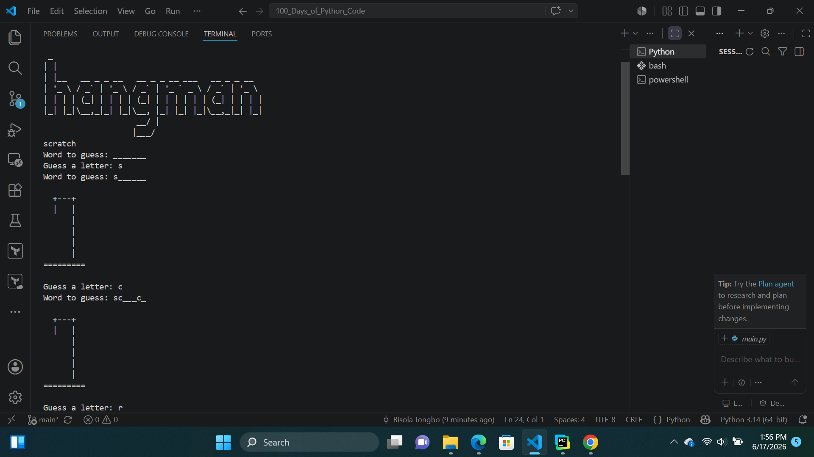
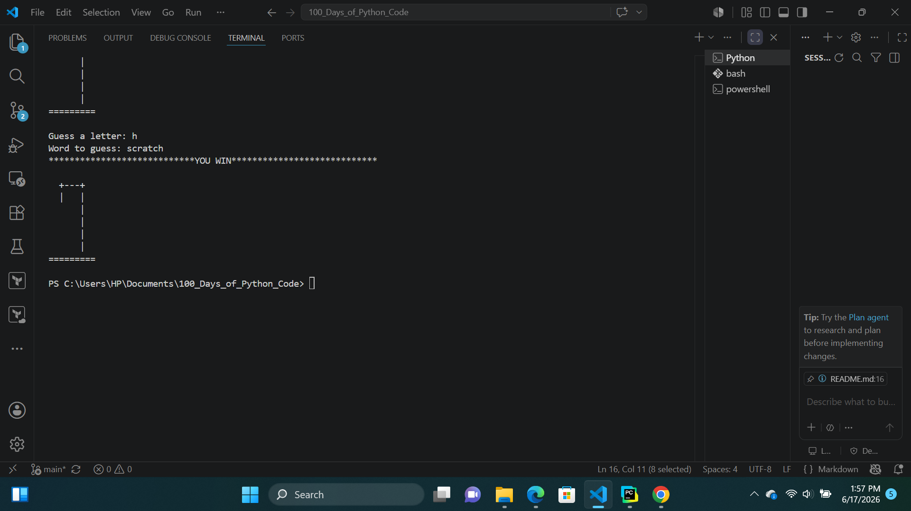
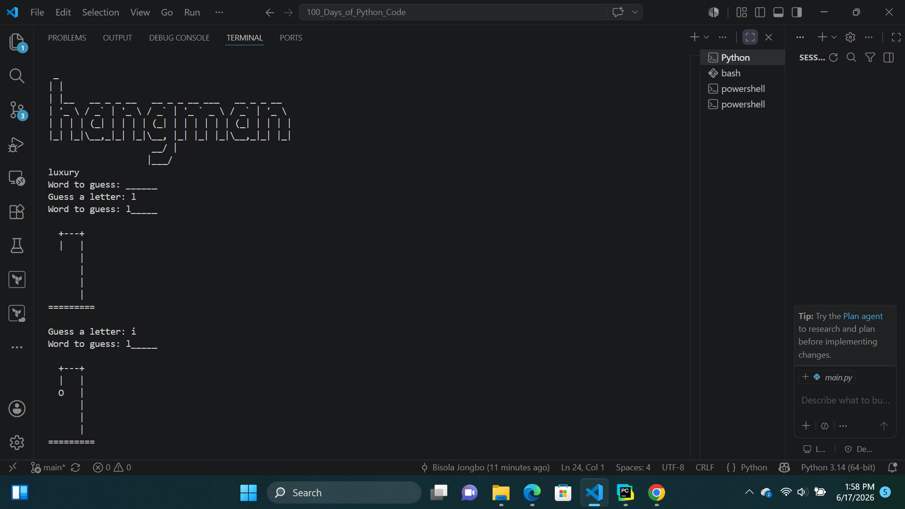
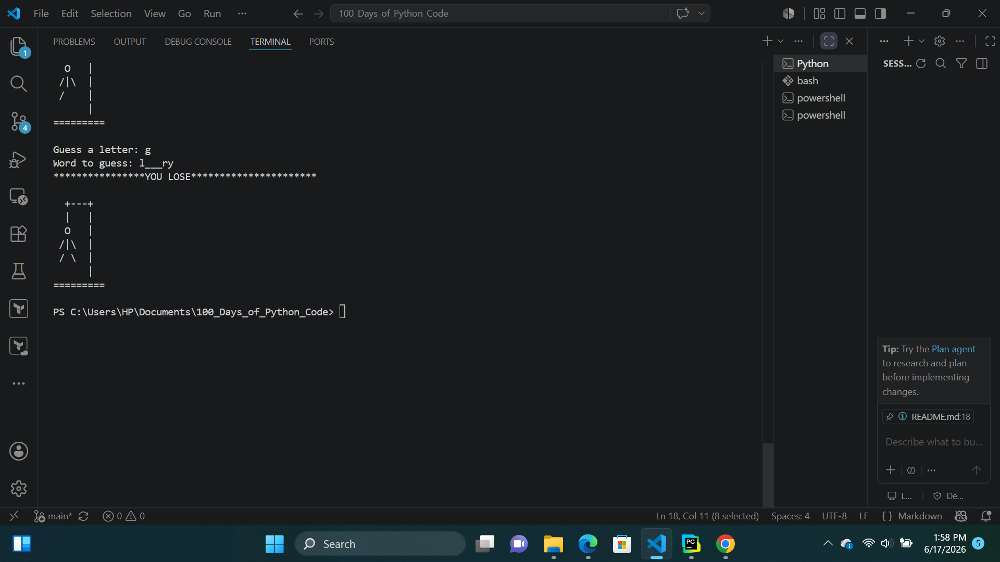

# Day-05:HANGMAN  PROJECT
## Project Objective 
The Hangman project is a word-guessing game where the player tries to guess a randomly selected word one letter at a time in order to win. If the player fails to guess all the letters within six lives, they lose the game. This project combines several Python concepts learned so far, including loops, functions, conditionals, and string manipulation.

## How Hangman  Works
The program randomly chooses a word from a predefined list of words. It then creates a display list using underscores (_) to represent each unguessed letter, while another list stores the actual letters of the selected word.

The player is prompted to guess one letter at a time. If the guessed letter is correct, it replaces the corresponding underscore in the display. If the guess is wrong, the player loses a life.

The game continues until the player either successfully get all the letters and wins the game , or exhausts all six lives, resulting in a game over.

## Output

