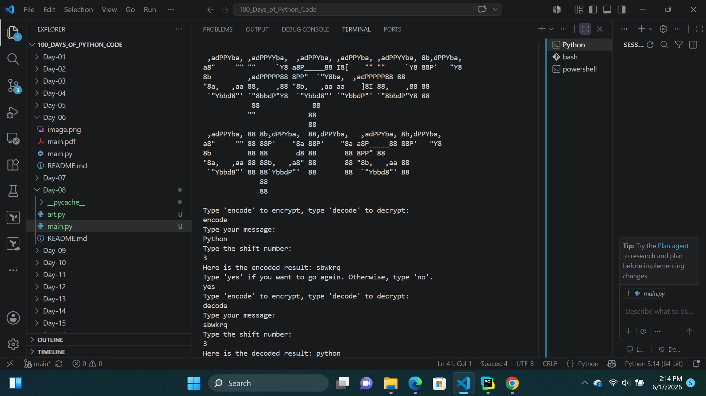
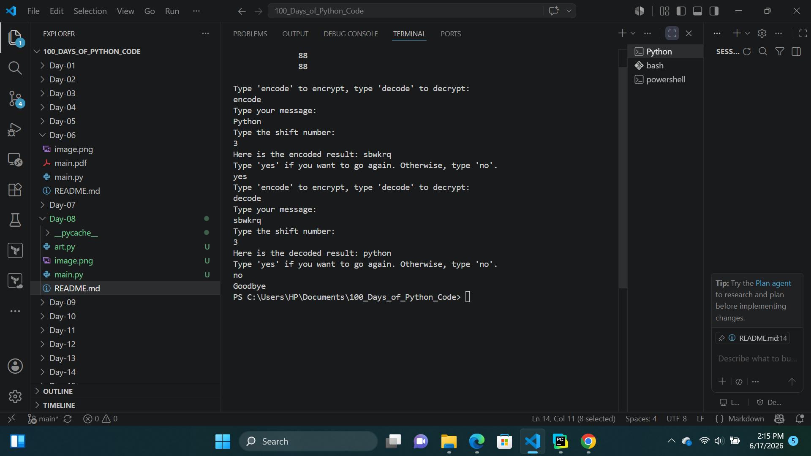

# Day-08:Caesar Cipher Project
## Project Objective 
The Caesar Cipher is a basic encryption program that shifts letters in a message according to a user-defined shift value. It works by moving each letter forward or backward through the alphabet based on the chosen direction (encode or decode), allowing messages to be encrypted or decrypted. This project helped me gain a fundamental understanding of encryption concepts using Python.

## What i learnt
1. Functions with input:Functions with input allow you to pass data (called parameters or arguments) into a function. This helps the function perform tasks using dynamic values instead of fixed ones.
2. Positional arguments: A positional argument is an argument passed to a function in the correct order. The position of the value determines which parameter it is assigned to.
3. Keyword arguments:
A keyword argument is an argument passed to a function using the parameter name, so the order does not matter. You specify which parameter the value belongs to.
## How Caesar Cipher   Works
1.Caesar Cipher program ask User type "encode" if they want to encode a message or "decode" if the want 
they want to decode a message
2. If the user want to encode it shift the letter  forward and if the user want to decode it shift the letter backward.
3. The program ask if user want to try again and if yes the program continues and if no the program ends

## Output

