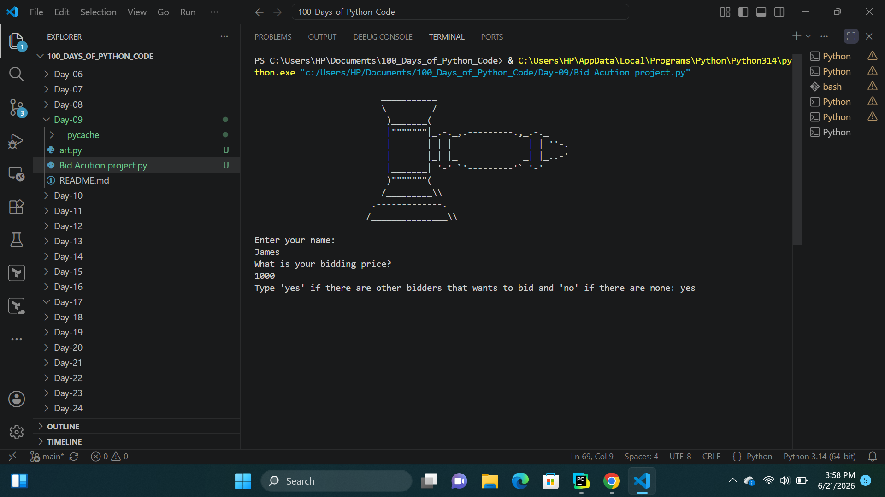
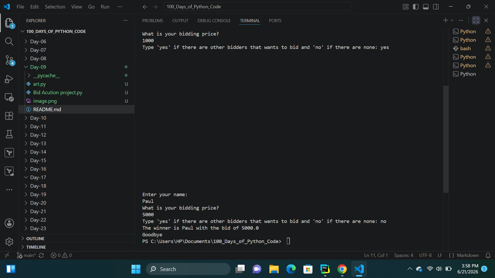

# Day-09: Blind Auction Project
## Project Objective 
The objective of this project is to build a Python-based blind auction system that allows multiple participants to submit bids without seeing each other's offers. The program collects bidder information, stores bids, determines the highest bidder, and announces the winner at the end of the auction.

## What i learnt
- How to create and call functions using def.
- How functions help organize code into reusable blocks.
- How to store data using key-value pairs.
- How to save bidder names as keys and bid amounts as values.
- How to use a while loop to keep the program running until a condition is met.
- How to use a for loop to iterate through dictionary entries.
- How to use if, elif, and else statements to control program flow.
- How to validate user input and handle invalid responses.
- How to track the highest bid and winning bidder using variables.

## How It Works
1. The program asks each participant:
    - Enter your name.
    - Enter your bidding price.
2. Then ask the user:
    - If the answer is "yes", the program clears the screen and waits for the next bidder.
    - If the answer is "no", the auction ends.
    - If the answer is invalid, the program displays an error message and asks again.
3. Determine the winner,When bidding ends, the program loops through all stored bids and compares each amount with the current highest bid and the program displays the winner's name and bid amount.

## Output

