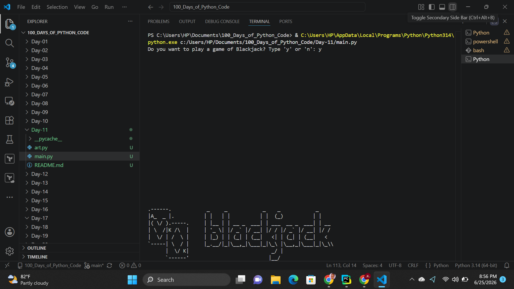
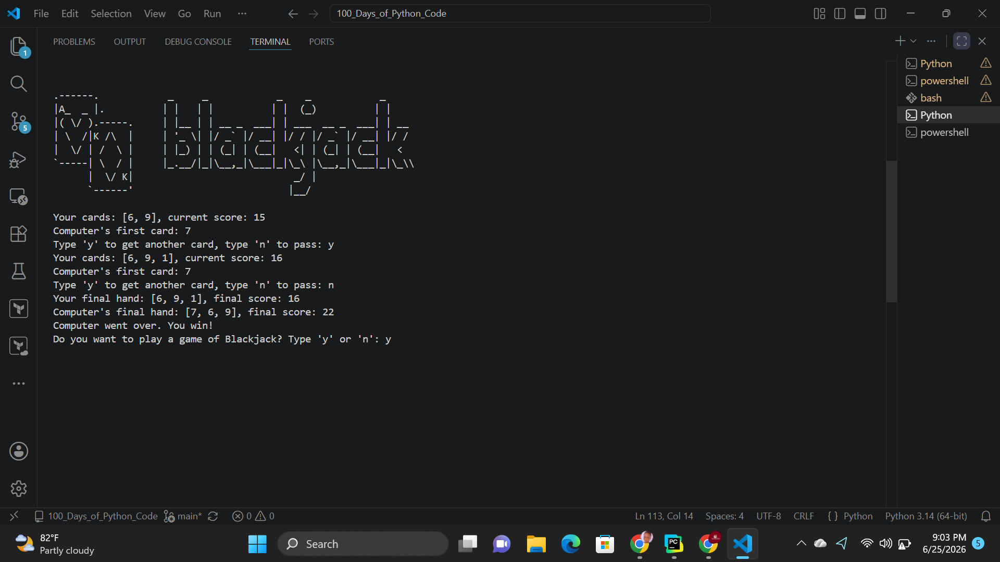

# Day-11: BlackJack Game Capstone Project
## Project Objective 
The objective of this project is to create a simplified Blackjack card game in Python where a player competes against the computer. The game allows the player to draw cards, calculate scores, and determine the winner based on Blackjack rules while practicing the use of functions, loops, conditionals, and lists.

## How It Works

1. The program asks the user if they would like to play a game of Blackjack.
2. If the user chooses to play, two random cards are dealt to both the player and the computer.
3. The player's score is calculated and displayed along with one of the computer's cards.
4. The player can choose to draw additional cards or pass.
5. If the player's score exceeds 21, the player loses automatically.
6. The computer continues drawing cards until its score reaches at least 17.
7. Special rules are applied:
    - A score of 21 with two cards is treated as Blackjack.
    - An Ace (11) is converted to 1 when necessary to prevent the score from exceeding 21.
8. Once both turns are complete, the final scores are compared.
9. The program announces the winner based on Blackjack rules.
10. After the game ends, the player can choose to start a new game or exit the program.

## Output

