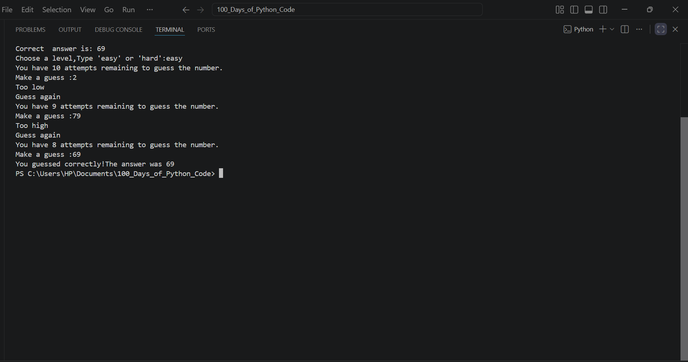

# Day-12: Number Guessing
## Project Objective 
The objective of this project is to build a Number Guessing Game in Python where the computer randomly selects a number between 1 and 100, and the player tries to guess it within a limited number of attempts based on the selected difficulty level. The project demonstrates the use of functions, loops, conditional statements, user input, and random number generation.

## What i learnt
- Local vs Global Scope and how variables are accessed in Python.
- Python does not have block scope for if, for, and while statements.
- How to modify global variables using the global keyword.
- How constants are defined using uppercase variable names.
- How global scope allows variables to be shared across functions.
- How to apply scope and constants in a real-world Python project.

## How It Works
1. The program displays the game logo and welcomes the player.
2. A random number between 1 and 100 is generated as the secret number.
3. The player selects a difficulty level:
    - Easy → 10 attempts
    - Hard → 5 attempts
4. The player makes a guess.
5. The program compares the guess with the secret number:
    - If the guess is higher than the answer, it displays "Too high".
    - If the guess is lower than the answer, it displays "Too low".
    - If the guess is correct, the player wins and the correct answer is displayed.
6. After each incorrect guess, the number of remaining attempts is reduced by one.
7. The game continues until:
    - The player guesses the correct number, or
    - All attempts are used up, resulting in Game Over.
8. If attempts remain after an incorrect guess, the player is prompted to guess again.

## Output

.png>)