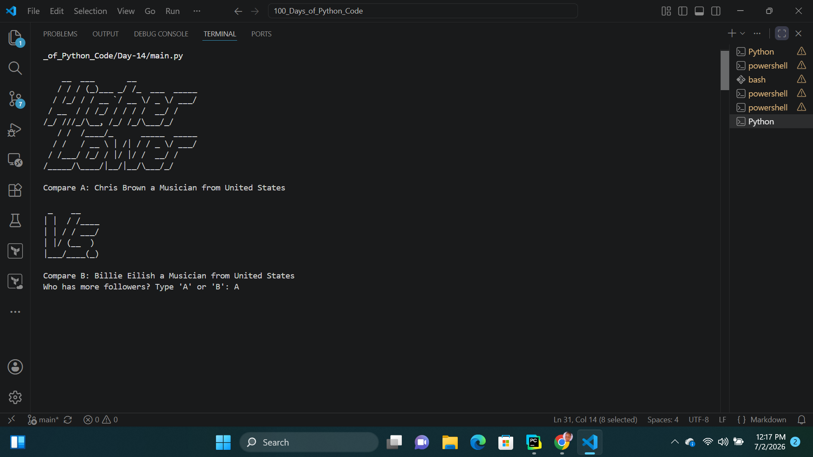
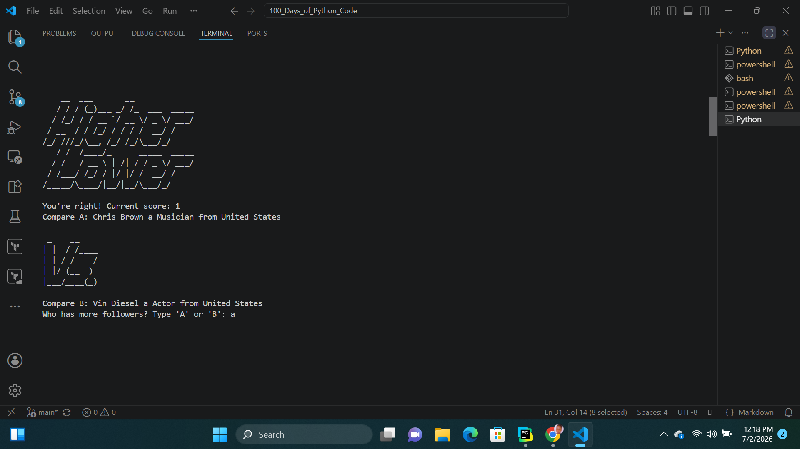
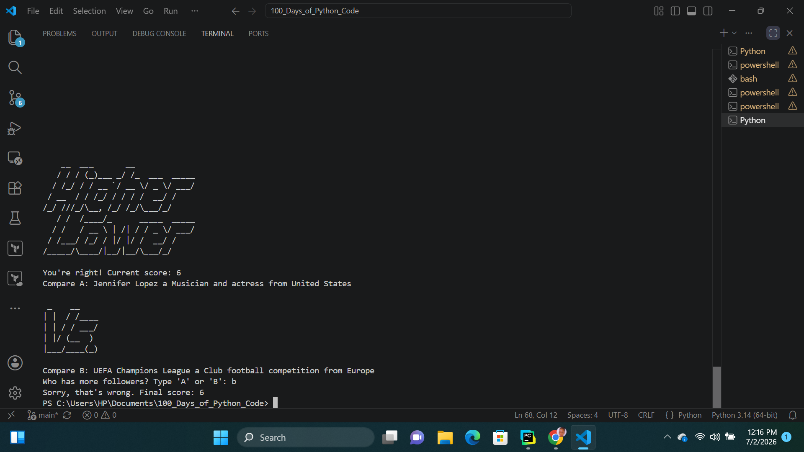

# Day-14: Higher or Lower Game
## Project Objective
The Higher Lower Game is a Python console application where players compare two celebrities and guess which one has more social media followers. The objective is to keep guessing correctly to build the highest possible score. The game continues until the player makes an incorrect guess.

## Features
Randomly selects two celebrities for comparison.
Displays each celebrity's name, description, and country.
Prompts the player to guess who has more followers.
Tracks and updates the player's score after every correct answer.
Keeps the winning celebrity for the next round.
Ends the game when the player makes an incorrect guess and displays the final score.

## How It Works
1. The game displays a welcome logo.
2. A random celebrity is selected as Celebrity A.
3. Another random celebrity is selected as Celebrity B, ensuring it is    different from Celebrity A.
4. The player is shown information about both celebrities.
5. The player guesses whether A or B has more followers.
6. The game compares the follower counts to determine the correct answer.
7. If the player's guess is correct:
     - The score increases by one.
    - The current score is displayed.
    - If Celebrity B has more followers, B becomes the new Celebrity A.
    - A new Celebrity B is selected, and the game continues.
8. If the player's guess is incorrect:
   - The game ends.
   - The player's final score is displayed.

   ## Output
   
   
   
