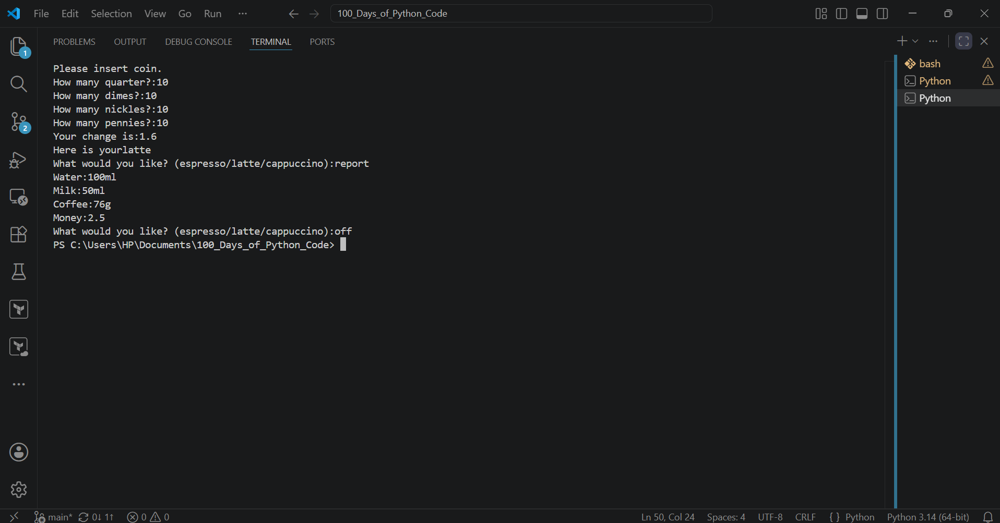

# Day-15: Coffe Machine Project
## Project Objective
Build a command-line Coffee Machine application in Python that simulates the operation of a real coffee vending machine. The program allows users to order different coffee drinks, checks whether there are enough ingredients available, processes coin payments, calculates change, updates available resources, and tracks total profit.
## Features
1. Offers three coffee options:
    * Espresso
    *  Latte
    * Cappuccino
2. Checks if there are enough ingredients before preparing a drink.
3. Accepts coin payments (quarters, dimes, nickels, and pennies).
4. Verifies whether the payment is sufficient.
5. Calculates and returns change when necessary.
6. Deducts the required ingredients after a successful purchase.
7. Tracks the total profit earned by the coffee machine.
8. Displays a resource report showing:
    * Water
    * Milk
    * Coffee
    * Money earned
9. Allows the machine to be turned off using the off command.
## How It Works
1. Choose a Drink – The user selects either espresso, latte, or cappuccino.
2. Check Resources – The machine verifies that there is enough water, milk, and coffee to prepare the selected drink.
3. Process Payment – The user inserts coins, and the machine calculates the total amount entered.
4. Complete the Transaction – If the payment is sufficient, the machine returns any change, and deducts the required ingredients from its resources.
5. Serve the Drink – The selected coffee is prepared and served. Users can also enter report to view available resources and profit or off to shut down the machine.

   ## Output
 