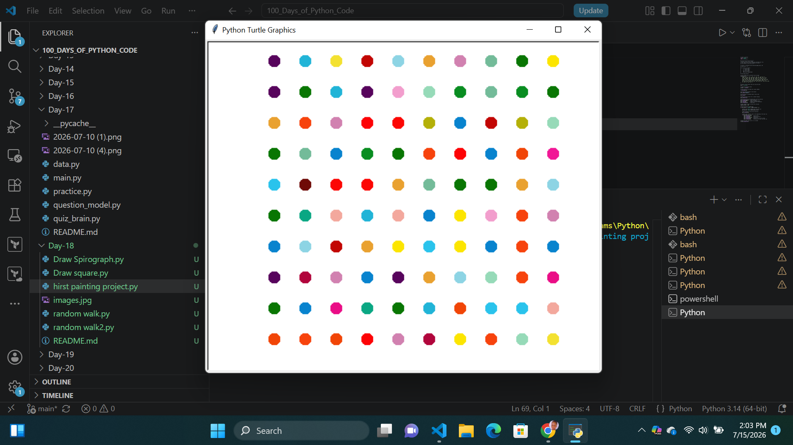

# Day-18: Hirst Dot Painting Generato
## Project Overview
The Hirst Dot Painting Generator is a Python project that recreates the famous spot paintings inspired by artist Damien Hirst using the Turtle Graphics module. The program randomly selects colors from a predefined list of RGB values and arranges them into a 10 × 10 grid of colorful dots.

## What I Learnt
1. Practice using Python's Turtle Graphics module.
2. Learn how to work with RGB colors in Python.
3. Understand how to use loops to create repeated patterns.
4. Use the random module to generate different color combinations.
5. Apply coordinate movement to create a structured grid of dots.
## How It Works
1. A list of RGB colors is extracted from an image using the Colorgram library (this only needs to be done once).
2. The extracted RGB values are stored in a Python list.
3. The turtle moves to the starting position at the bottom-left of the screen.
4. A loop draws one dot at a time using a randomly selected color from the list.
5. After every 10 dots, the turtle moves up one row and returns to the beginning to continue drawing until all 100 dots are completed.

## Features
1. Draws a 10 × 10 grid of colorful dots.
2. Uses 100 randomly colored dots.
3. Randomly selects colors from a predefined RGB color palette.
4. Uses Turtle Graphics for visual drawing.
5. Mimics the style of Damien Hirst's spot paintings.

## Technologies Used
Python 3
Turtle Graphics
Random Module
Colorgram (used once to extract colors from an image)

   ## Output
   The program generates a colorful dot painting similar to the artwork below:
   
