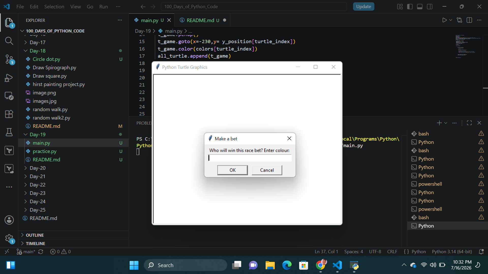
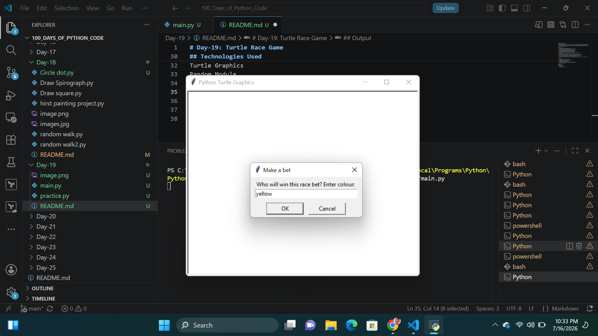
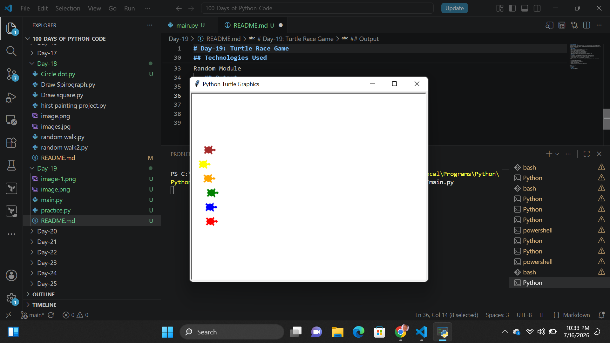
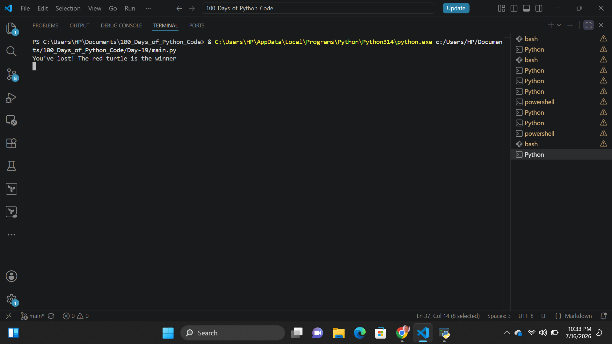

# Day-19: Turtle Race Game
## Project Overview
The objective of this project is to simulate a turtle race using Python's Turtle Graphics module while demonstrating the use of loops, lists, turtle textinput, random number generation, and conditional statements. The game also introduces event driven programming by interacting with the user before the race starts.

## What I Learnt
Through this project, I learned how to:
1. Create graphical applications using the Turtle module.
2. Build and manipulate multiple Turtle objects.
3. Store objects inside a list and iterate through them.
4. Generate random movements using the random module.
5. Accept user input through graphical dialog boxes.
6. Detect a winner by checking each turtle's position.
7. Combine loops, conditions, and objects to build an interactive gam.
## How It Works
1. The game window is created using the Turtle Graphics module.
2. Six turtles are positioned at the starting line, each with a unique color.
3. The player enters the color of the turtle they believe will win the race.
4. Each turtle moves forward by a random distance during every round.
5. The race continues until one turtle reaches the finish line.
6. The program announces the winning turtle and tells the player whether their prediction was correct.

## Features
1. Six turtles with different colors
2. User places a bet on the winning turtle
3. Random movement for each turtle
4. Automatic winner detection
5. Displays whether the user's prediction was correct
6. Interactive graphical interface using Python Turtles.

## Technologies Used
* Python 3
* Turtle Graphics
* Random Module
   ## Output
   
   
   
   
 
 
